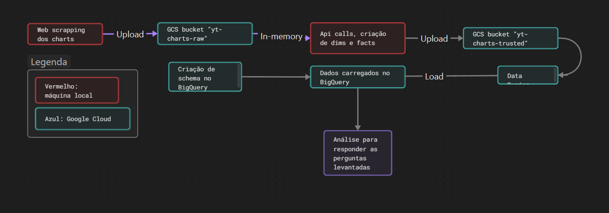
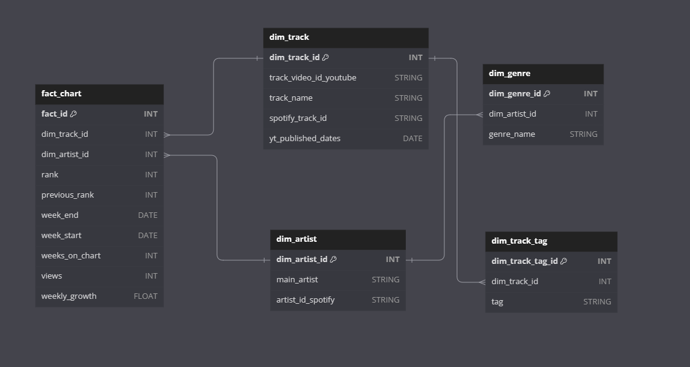
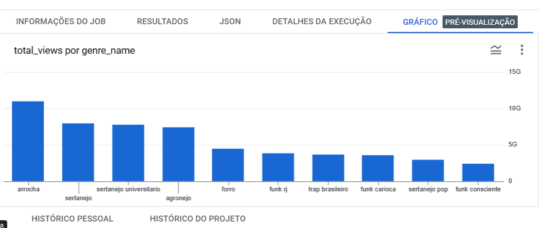
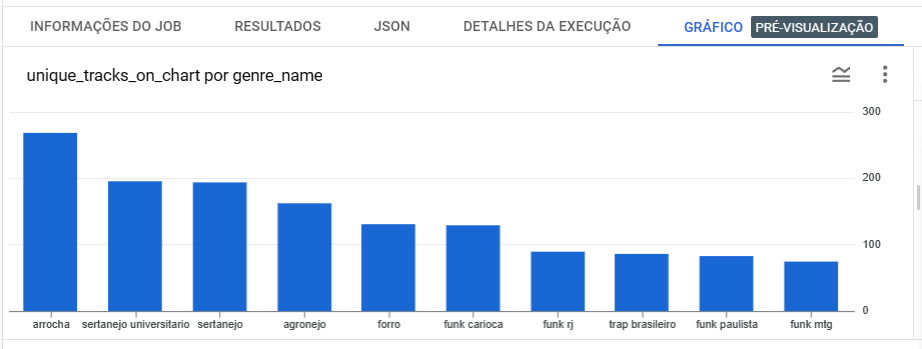
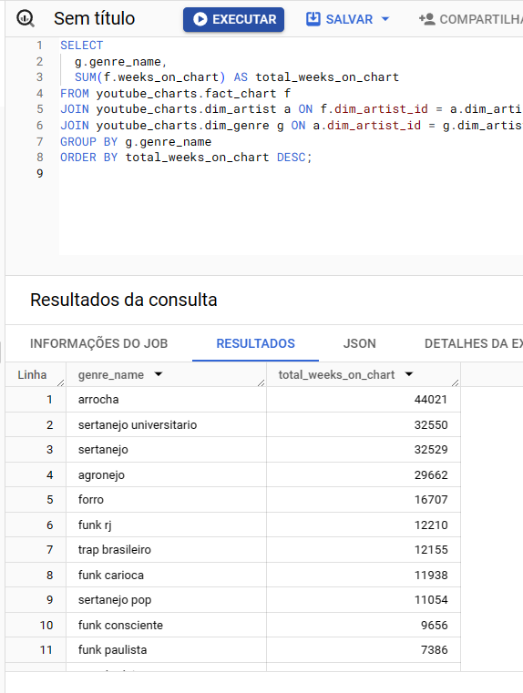

# MVP3_Engenharia de Dados

Entrega do MVP de engenharia de dados para a terceira sprint da Especialização em Ciência de Dados e Analytics da Puc-Rio. Os resultados estão no [relatorio.md](relatorio.md)

Índice:
1. Início
2. Resultados da análise
3. Conclusões
4. Como melhorar esse projeto

### Início

O professor solicitou  realizássemos um pipeline de engenharia de dados na nuvem, envolvendo ETL e a construção de um data warehouse. Optei pela construção de um data warehouse contendo dados históricos do charts do youtube music desde o início de janeiro de 2022 até o último fechamento em setembro de 2023.

O objetivo será analisar a performance dos gêneros nos charts do youtube.

O dado do gênero é extraído da api do spotify e a partir do artista. Entretanto, os charts são por faixa, que tem ids próprios no ecossistema do youtube e nem sempre os dados dão "match" com a api do spotify, o que adiciona uma complexidade ao exercício. Como será, acredito que existe possíveis problemas de qualidades de dados, porém foi possível extrair uma conclusão.

Abaixo, um uma visualização dos passos tomados

Aqui, o schema do nosso data warehouse no BigQuery

### Resultados da análise

Verificamos que é possível, ainda que os charts do youtube não forneçam esses dados, identificar qual a predominância e a performance dos gêneros nos charts do youtbue por meio do wrangling com dados da api do spotify.

O gênero vencedor nos charts do youtube no período análisado é o arrocha, pelas três métricas utilizadas aqui nesse projeto:

Os percalços dessa análise, repito, está bem completa no [relatorio.md](relatorio.md)

### Conclusões

Espero, com esse trabalho um tanto quanto conturbado, ter mostrado o potencial da engenharia de dados e do `wrangling` de dados, ainda que de fontes diferentes, para alcançar potenciais analíticos que antes não estariam evidentes. Ainda que com certos problemas de qualidades dos dados, é possível, pelos "grandes números", extrair conclusões. No caso aqui em questão, nem foram tão grandes números, visto que o `facts` possui cerca de 9000 linhas. Em casos maiores, a disparidade pode ser menor ainda. De qualquer forma, cada caso é um caso. Aqui estou mostrando o **potencial**, não necessariamente uma regra.

### Como melhorar esse projeto

- Modularizar o código, sobretudo o presente no `wrangling_monolith.ipynb`, feito às preças. Para isso, criar módulos `.py` respeitando os princípios `SOLID`, cada qual com sua função.
- Acredito que a adoção do paradigma funcional seria o ideal também, com um módulo com funções referentes às apis e outro com as funções que executem operações de processamento e tratamento de dados.
- Identificar e estudar formas, se possível, de realizar chamadas assíncronas nas apis, agilizando a execução do código.
- Identificar o erro que aconteceu no Big Query, possivelmente um erro de permissão, que impediu também que eu realizasse o ETL por meio de código python.
- Modificar a lógica do programa para uma cíclica, que rode toda sexta-feira (os charts fecham às quintas) e realize todos os processos de ETL. Dessa maneira, será possível acompanhar dados históricos.
- Identificar e trazer dados úteis a análise dos gêneros, como por exemplo:
    - Comment count: a api do youtube mostra quantos comentários foram feitos e quantos likes foram dados. Como pegamos dados históricos e o request é por vídeo, não faz sentindo ter feito isso aqui nesse projeto. Porém, num contexto em que o projeto rode semanalmente, será possível identificar e calcular a variação de comentários e likes em vídeos. Agrupando por gênero, teremos uma métrica de engajamento.
    - Tags: como dito, a quota da api me impediu de fazer uma tabela de tags. Porém, seria interessante fazê-la, limitando por cinco (número arbitrário) e sendo capaz de atualizar as tags na medida em que o workflow identifique atualizações.
    - "Audio features". A api do spotify fornece "audio features", dados interessantes extraídos de seus algoritmos de machine learning sobre as faixas. Podemos identificar qual gênero possui mais ou menos de tal ou qual audio feature, e também ver se existe relação entre as audio features e o crescimento ou não de um gênero nos charts.