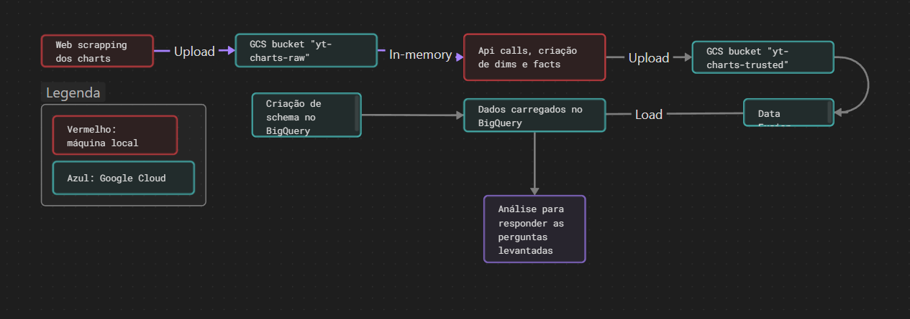
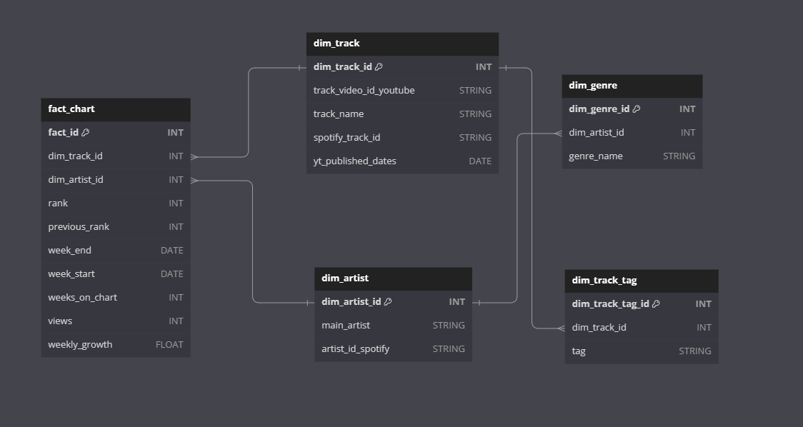

# O exercício

O professor solicitou  realizássemos um pipeline de engenharia de dados na nuvem, envolvendo ETL e a construção de um data warehouse. Optei pela construção de um data warehouse contendo dados históricos do charts do youtube music desde o início de janeiro de 2022 até o último fechamento em setembro de 2023.

O objetivo será analisar quais gêneros.

O dado do gênero é extraído da api do spotify, o que adiciona uma complexidade ao exercício. Como será, acredito que existe possíveis problemas de qualidades de dados, porém foi possível extrair uma conclusão.

# Visual dos passos do pipeline

# Passo-a-passo resumido

### Extração dos dados

Foi instalado o `Google SDK` para uma interação mais fácil e rápida com o ambiente. Com o comando `gcloud projects create yt-charts-1237-400718` criei meu projecto na nuvem. Com `gcloud config set project yt-charts-1237-400718`, estabelici a conexão com o projeto. É possível verificar a conexão com o comando `gcloud config get-value project`.

Em seguida, foram criados os *buckets* `yt-charts-raw`, `yt-charts-trusted` e `-yt-charts-fusion-temp` para utilização no ETL com o comando `gcloud storage buckets create [BUCKET NAME]`.

O comando `gsutil ls` permite uma visualização dos *buckets* criados:

Em seguida, foi criado o ambiente python com conda, instalando as bibliotecas selenium, pandas, spotipy, google-apy-python-client, google-cloud.

O objetivo agora é retirar os dados da página `charts.youtube.com`, mais especificamente dados do Brasil e na aba "música". Optei por utilizar o `selenium web-driver`.

Cada página permite baixar um .csv, e cada página semanal é formada por uma url padrão + as datas de referência. Para facilitar nossa vida, essas datas se encontram na aba `"networks"` do `DevTools`. Copiei e colei no arquivo `reference_dates.json`.

Num projeto contínuo, esse seria o primeiro passo e, para evitar esse passo manual, o ideal é que o scrap seja rodado semanalmente. Assim, a extração dos dados combinará com a página inicial que a url `charts.youtube.com` abrirá.

Foi criado um ambiente python com `conda create --name` e instalado as seguintes bibliotecas e dependências:
- jupyter notebook
- pandas
- matplotlib
- selenium
- spotipy
- google api python client
- google-cloud

Foi executado, então, o [web-scraping](youtube_weekly_charts_scrapper.py).

Ao final, os arquivos são carregados no bucket `yt-charts-raw`

O `schema` pode ser visualizado abaixo e foi criado segundo o arquivo [create_tables.sql](assets/create_tables.sql).

Com o `schema` em mente, fiz as transformações constantes no [wrangling_monolith.ipynb](wrangling_monolith.ipynb) e upei novamente para o bucket `yt-charts-trusted`.

As transformações foram: peguei os dados presentes no dataset dos charts e, em seguida, realizei um tratamento e adicionei hashes para identificar ids únicos. Assim, utilizando a api do spotify, consegui, por meio da "search" da api, extrair id único de artista e o gênero associado a eles.

Como a api responde gênero com uma lista, fiz questão de coletar todos em um dataframe a parte, emq ue as chaves de gênero e artista se repetem, e a chave primária é o conjunto artista+gênero.

Na tabela de artistas, utilizei um padrão da indústria fonográfica e selecionei o "artista principal", isto é, aquele que é o "dono" da música no serviço de streaming. Passei a identificar os artistas de cada faixa dessa maneira.

A `dim_track`, por sua vez, possui o id de vídeo do youtube, e o id de áudio extraído do spotify. As datas de publicação tiveram o problema já explicado de limite de quota.

A tabela `dim_track_tag` seria para extrair, repetindo as track_ids, um máximo de até cinco tag por vídeo. Como atingi limite de quota, não consegui realizar. Esse dado fortaleceria a análise pois, embora a api do youtube não retorne gênero como faz a api do spotify, nas tags muitas vezes há o gênero da música. Dessa maneira, por meio de uma wordcloud, poderíamos visualizar a predominância de um ou outro gênero.

Por fim, a tabela `fact_chart` contém os dados históricos dos charts semanais.

Tive uma série de complicações nesse trabalho. O primeiro foi que a api do youtube atingiu seu máximo de requests devido a um erro de código meu, de maneira que não pude extrair datas de publicação dos vídeos:

Segundo foi que o Google Data Fusion não reconheceu, sabe-se lá porque, o schema, dando bugs que me motivaram a fazer o carregamento de maneira manual:

Ainda assim, fica o registro

Assim, upei manualmente os arquivos

Porém, o schema não foi reconhecido automaticamente. Até foi, em relação aos tipos de dados, mas não às headers

Isso me fez levar um tempo maior, visto que a plataforma ficava *lagging*.

Dessa maneira, não consegui finalizar a análise. Entretanto, gostaria de finalizá-la de qualquer forma, e o farei nos próximos minutos.

Por ora, minhas reflexões são as de que embora a mescla de dados de diferentes de apis com padrôes e parâmetros diferentes seja problemática, ela é possível e pode adicionar potencial analíticos. Por exemplo, se é possível fazer uma análise muito bem elaborada do chart do spotify por causa da api do spotify, no caso do Youtube é um pouco diferente pois a api é mais pobre. Ainda assim, se mesclarmos dados da api do spotify, fica possível engrandecer a análise.

